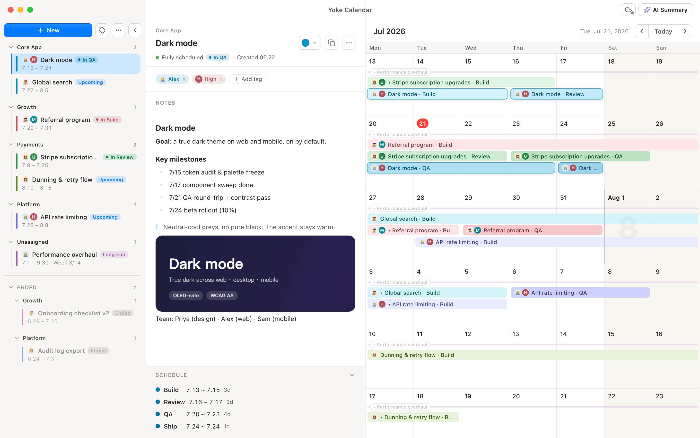

# Yoke Calendar

**Master your schedule — a desktop scheduling calendar for individuals and teams**

Drag-select on the calendar to schedule · AI progress summaries · Multi-device sync · Local-first

[🌐 Website](https://yoke.xheldon.com) · [⬇️ Download](https://yoke.xheldon.com/#download) · [📖 Docs](https://yoke.xheldon.com/docs.html) · macOS / Windows / Linux · Free

**English** · [简体中文](README.zh-CN.md)

## What is it

Yoke Calendar is a desktop scheduling tool: drag to select a span on the calendar and drop a requirement's stages (Dev / Integration / Test / Release) right onto it. Swim-lane color bars make "who's doing what, and what's next" obvious at a glance.

It's a **scheduling tool**, not a task manager — a schedule has no "done / not done", only past / in-progress / upcoming.

## Features

- 🗓️ **Drag to schedule** — drag-select on the calendar to lay down a requirement's stages; once placed, drag the bars to fine-tune. What you see is what you get.
- ✨ **AI progress summaries** — connect 14+ providers (OpenAI / Claude / Gemini / DeepSeek / Qwen / Kimi / Zhipu …), or reuse your local Claude Code / Codex CLI, to generate weekly reports, risk reviews, and status updates in one click.
- ☁️ **Multi-device sync** — a private GitHub repo, or any WebDAV server (Nextcloud, etc.). Syncs automatically in the background on demand; credentials are encrypted on your device and never travel with your data.
- 📡 **Calendar subscriptions + holidays** — subscribe to any `.ics` calendar as a read-only overlay; built-in Chinese holidays + lunar calendar + make-up workdays, with switchable regions.
- 🔒 **Local-first** — your data lives on your machine and works offline. Sync and AI are entirely optional; your privacy is yours to decide.
- ⬇️ **Auto-update** — signed + notarized installers download quietly in the background; restart to update.

## Download

Head to [Releases](../../releases) and grab your platform:

| Platform | Notes |
| --- | --- |
| **macOS** | Apple Silicon / Intel, signed + notarized |
| **Windows** | one installer covers x64 / ARM64 / x86 |
| **Linux** | AppImage |

Once installed, it checks for updates automatically — no manual reinstalls.

## Documentation

Full usage docs (scheduling, sync, AI summaries, calendar subscriptions, backups, FAQ): **[yoke.xheldon.com/docs.html](https://yoke.xheldon.com/docs.html)**

---

This repository hosts Yoke Calendar's website and release artifacts; the app's source lives in a separate private repository.
