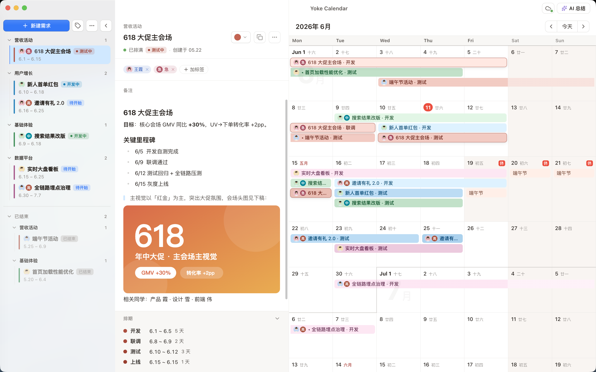

# Yoke Calendar

**把握排期 —— 个人和团队的桌面排期日历**

在日历上划选即排期 · AI 总结进度 · 多端同步 · 本地优先

[🌐 官网](https://yoke.xheldon.com) · [⬇️ 下载](https://yoke.xheldon.com/#download) · [📖 文档](https://yoke.xheldon.com/docs.html) · macOS / Windows / Linux · 免费

[English](README.md) · **简体中文**

## 这是什么

Yoke Calendar 是一款桌面排期工具:在日历上拖拽划选一段时间,就能把一个需求的各个阶段(开发 / 联调 / 测试 / 上线)直接排上去。泳道式色条,让「谁在做什么、下一步是什么」一眼可见。

它是一个**排期记录工具**,不是任务管理 —— 排期本身不分「完成 / 未完成」,只有 过去 / 进行中 / 未来。

## 功能

- 🗓️ **划选即排期** —— 日历上拖拽划选,直接落成需求的各阶段;落库后拖动色条即可微调,所见即所得。
- ✨ **AI 进度总结** —— 接入 OpenAI / Claude / Gemini / DeepSeek / 通义 / Kimi / 智谱 等 14+ 服务商,或复用本机 Claude Code / Codex CLI,一键生成周报、风险盘点、对上汇报。
- ☁️ **多端同步** —— GitHub 私有仓库,或任意 WebDAV(坚果云 / Nextcloud)。后台按需自动同步,密钥本机加密、永不随数据上传。
- 📡 **日历订阅 + 节假日** —— 订阅任意 `.ics` 日历作只读叠加;内置中国节假日 + 农历 + 调休,多地区可切换。
- 🔒 **本地优先** —— 数据存在你本机,离线可用。同步、AI 全部可选,隐私你说了算。
- ⬇️ **自动更新** —— 签名 + 公证的安装包,后台静默下载,重启即更新。

## 下载

前往 [Releases](../../releases) 下载对应平台:

| 平台 | 说明 |
| --- | --- |
| **macOS** | Apple Silicon / Intel,已签名 + 公证 |
| **Windows** | 一个安装包覆盖 x64 / ARM64 / x86 |
| **Linux** | AppImage |

装好后会自动检查更新,无需手动重装。

## 文档

完整使用说明(排期、同步、AI 总结、日历订阅、数据备份、常见问题):**[yoke.xheldon.com/docs.html](https://yoke.xheldon.com/docs.html)**

---

本仓库托管 Yoke Calendar 的官网与发布产物;应用源码在另一个私有仓库。
